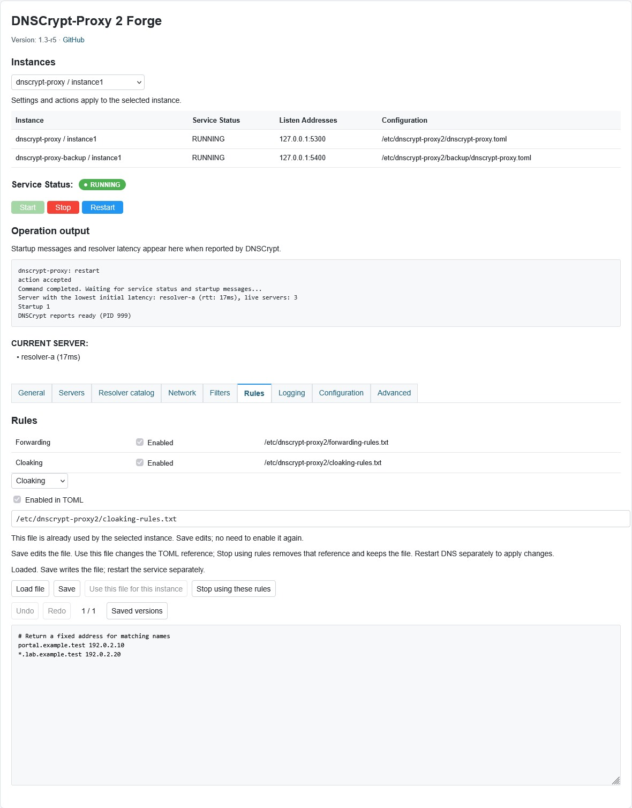

# DNSCrypt-Proxy 2 Forge

[English documentation](README.md)

Интерфейс LuCI для DNSCrypt-Proxy 2 с **поддержкой нескольких инстансов**, **подробным выводом запуска и перезапуска** и **бережным сохранением конфигурации**.

Основан на [ewgen198409/luci-app-dnscrypt-proxy2](https://github.com/ewgen198409/luci-app-dnscrypt-proxy2), ревизия [`b9978fe`](https://github.com/ewgen198409/luci-app-dnscrypt-proxy2/tree/b9978fe2f448e8fb7a6aaa03762f97f1c293daba). По сравнению с оригинальным интерфейсом Forge добавляет независимое управление несколькими инстансами DNSCrypt, подробный вывод запуска и перезапуска, бережное сохранение конфигурации, кастомные DNS stamps, редакторы файлов правил с отменой/повтором и сохранёнными версиями, а также каталог DNS-серверов с поиском.

Текущая версия: **1.3-r6**. Работа проверена на **OpenWrt 24.10.1**, **GL.iNet GL-MT6000**, mediatek/filogic, aarch64_cortex-a53. Также проверены установка и корректная работа предыдущего IPK **0.1.3-r1** на **OpenWrt 23.05.5**. Для **OpenWrt 25.12.5** доступна отдельная сборка APK с проверенным содержимым; проверка работы на роутере с этой версией ещё не выполнена.



*Пример интерфейса с тестовыми инстансами и синтетическим выводом запуска.*

## Основные возможности

- Отдельные настройки, журналы и управление сервисом для каждого инстанса DNSCrypt.
- Вывод запуска/перезапуска, имена DNS-серверов и задержка, когда DNSCrypt сообщает эти данные.
- Сохранение нетронутых настроек и комментариев TOML, проверка внешних изменений и атомарная запись файлов.
- Добавление, изменение и удаление кастомных DNS через stamps.
- Редактирование forwarding, cloaking, списков блокировки/разрешения доменов и IP и файлов captive portals.
- Отмена/повтор изменений, просмотр и восстановление последних 10 сохранённых версий файлов.
- Поиск по полному каталогу DNS и выбор серверов для выбранного инстанса.

## Установка

Скачайте ZIP для своей версии OpenWrt из раздела [Releases](https://github.com/numbereleven-a/luci-app-dnscrypt-proxy2_forge/releases) и распакуйте его. В каждом архиве находятся пакет, `SHA256SUMS`, документация и файлы лицензии. Для OpenWrt 24.10.1 проверьте контрольную сумму извлечённого IPK и перенесите его на роутер.

```sh
opkg install /tmp/luci-app-dnscrypt-proxy2-forge_1.3-r6_all.ipk
/etc/init.d/rpcd reload
```

Для **OpenWrt 25.12.5** распакуйте соответствующий ZIP, проверьте APK по `SHA256SUMS` и установите:

```sh
apk add --allow-untrusted /tmp/luci-app-dnscrypt-proxy2-forge-1.3-r6.apk
/etc/init.d/rpcd reload
```

APK подписан локальным ключом SDK, поэтому для установки этого пакета требуется `--allow-untrusted`. IPK и APK — разные форматы; выбирайте пакет для своей версии OpenWrt.

Зависимости: `luci-base`, `rpcd-mod-file`, `luci-lib-jsonc`, `lua`, `libubus-lua` и `dnscrypt-proxy2`.

Обновите страницу LuCI и откройте **Службы → DNSCrypt-Proxy 2 Forge**. У пакета отдельный пункт меню, поэтому он может сосуществовать с исходным интерфейсом. Установка не меняет конфигурации DNSCrypt, настройки DHCP/DNS, failover и автозапуск сервисов.

## Использование

Перед редактированием и управлением сервисом выберите нужный инстанс.

- **Сохранить / Save** записывает выбранную конфигурацию.
- **Сохранить и применить / Save & Apply** записывает её и перезапускает выбранный сервис, только если он работает. Остановленный сервис остаётся остановленным; нажмите **Старт**, чтобы применить сохранённые настройки.
- **Запустить / Остановить / Перезапустить** управляют выбранным сервисом и показывают вывод операции.
- На вкладке **Конфигурация / Configuration** доступен редактор TOML. Сохраняйте текстовые правки отдельной кнопкой **Сохранить** внутри вкладки, затем перезапустите сервис для применения.
- Редакторы правил показывают, включён ли каждый файл в TOML. Сохранить записывает файл; Использовать этот файл меняет ссылку в TOML; отключение правил сохраняет сам файл.
- Редакторы поддерживают `.txt` и `.overall` до **1024 КиБ** внутри `/etc/dnscrypt-proxy2/`. Большие файлы правьте вручную через SSH.
- Отмена/повтор работают, пока редактор открыт. Предыдущие сохранённые версии остаются на роутере; выбор версии только загружает её в редактор. Для восстановления сохраните её явно.
- Каталог показывает все записи настроенных источников, включая исключённые фильтрами. Обновление следует расписанию DNSCrypt; перед применением выбора включите подходящие протоколы и фильтры.

## Поддерживаемая конфигурация и ограничения

- Работа проверена на OpenWrt **24.10.1**, GL-MT6000, mediatek/filogic, aarch64_cortex-a53.
- Для OpenWrt **25.12.5** проверены сборка и содержимое APK для той же платформы. Проверка работы на этой версии ещё не выполнена.
- Проверены установка и корректная работа предыдущего IPK **0.1.3-r1** с архитектурой `all` на OpenWrt **23.05.5**; текущий релиз на этой прошивке повторно не проверялся.
- Сервисы должны называться `dnscrypt-proxy*`, а TOML-файлы находиться в `/etc/dnscrypt-proxy2/`.
- Отдельными сервисами можно управлять независимо. Если несколько procd-инстансов используют один init-сервис, их настройки доступны, но кнопки управления отключены: действие может затронуть все инстансы этого сервиса.
- Остановленные сервисы с динамически вычисляемыми путями конфигурации не обнаруживаются путём исполнения init-скриптов.
- Форма поддерживает обычные скалярные значения и массивы, включая многострочные. Более сложный TOML редактируйте в текстовом редакторе.
- Текстовый редактор не проверяет синтаксис конфигурации средствами DNSCrypt перед сохранением.
- Проверка внешнего изменения не блокирует файл от записи другим процессом между проверкой и сохранением.
- Вывод syslog ограничен 250 подходящими строками из последних 1000 строк журнала. Чтение файлов журналов разрешено ACL пакета в `/etc/dnscrypt-proxy2/` и `/var/log/dnscrypt-proxy*`.

## Сборка и проверки

Используйте **SDK OpenWrt 24.10.1 mediatek/filogic**:

```sh
sh scripts/build-openwrt-24.10.1.sh /path/to/openwrt-sdk-24.10.1-mediatek-filogic_gcc-13.3.0_musl.Linux-x86_64
```

Скрипт проверяет версию и целевую платформу SDK. Пакеты и контрольные суммы сохраняются в `artifacts/1.3/openwrt-24.10.1-aarch64_cortex-a53/`.

```sh
node tests/multi-instance.test.cjs
node tests/browser.test.cjs
node tests/security-render.test.cjs
lua tests/rpc-logs.test.lua root/usr/libexec/rpcd/dnscrypt-forge
python scripts/verify-package.py /path/to/luci-app-dnscrypt-proxy2-forge_1.3-r6_all.ipk
```

Браузерные проверки требуют `selenium-webdriver`, Firefox и geckodriver. Пути можно задать через `SELENIUM_MODULE_ROOT`, `FIREFOX_BINARY` и `GECKODRIVER`. Для RPC-проверок нужны Lua 5.1, `luci.jsonc` и `ubus`.

Для сборки APK используйте **SDK OpenWrt 25.12.5 mediatek/filogic**:

```sh
sh scripts/build-openwrt-25.12.5.sh /path/to/openwrt-sdk-25.12.5-mediatek-filogic_gcc-14.3.0_musl.Linux-x86_64
python scripts/verify-apk-package.py /path/to/luci-app-dnscrypt-proxy2-forge-1.3-r6.apk /path/to/sdk/staging_dir/host/bin/apk
```

APK сохраняется в `artifacts/1.3/openwrt-25.12.5-aarch64_cortex-a53/`. Проверка APK требует Linux и apk-tools 3 из SDK.

## Лицензия и исходный проект

Лицензия **GPL-3.0-or-later**, как указано в метаданных и README исходного пакета. См. [LICENSE](LICENSE) и [NOTICE](NOTICE).

Исходный проект: [ewgen198409/luci-app-dnscrypt-proxy2](https://github.com/ewgen198409/luci-app-dnscrypt-proxy2).
